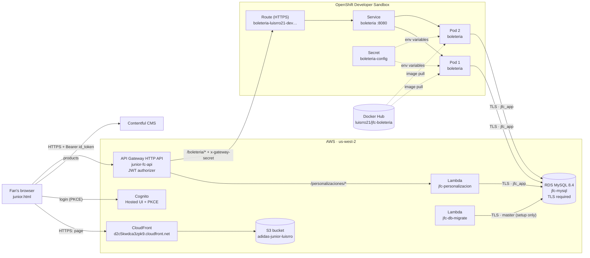
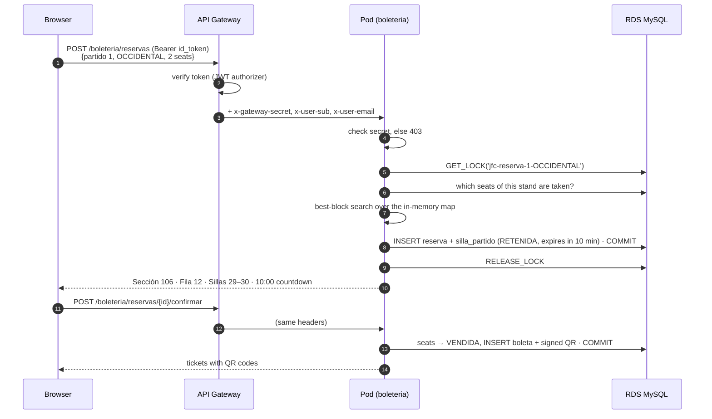

# Junior FC Store — Architecture

How every piece of the project connects: the static store, login, API Gateway, the two Lambda
functions, the Docker container on OpenShift, and the RDS database.

- **Light feature (AWS Lambda):** *Personalización de camiseta*: save a name and number for a jersey.
- **Heavy feature (Docker on OpenShift):** *Boletería*: pick the best seats in the stadium, hold them
  10 minutes, sell them with QR tickets, and show live occupancy on a stadium map.

Both go **through API Gateway** and both use **one RDS MySQL database**.

---

## 1. The big picture



| Piece | What it is | Where it's defined |
|---|---|---|
| CloudFront + S3 | Serves the static store (`junior-fc.html` published as `/junior.html`) | Set up in part 1 |
| Cognito | Login (Hosted UI, Authorization Code + PKCE); issues the `id_token` | Set up in part 1 |
| API Gateway `junior-fc-api` | The single entry point for both backends; verifies the token | `backend/template.yaml` |
| Lambda `jfc-personalizacion` | Jersey personalization (light feature) | `backend/src/personalizacion.py` |
| Lambda `jfc-db-migrate` | Creates and fills the database (run by hand, not public) | `backend/src/migrate.py` |
| RDS `jfc-mysql` | MySQL 8.4 with all the data for both features | `backend/template.yaml`, `backend/src/sql/` |
| Docker image `luisrro21/jfc-boleteria` | The ticketing service (heavy feature) | `services/boleteria/` |
| OpenShift Deployment / Service / Route / Secret | Runs 2 copies of the image and exposes them over HTTPS | `openshift/boleteria.yaml`, `openshift/secret.yaml` |

---

## 2. Every connection, hop by hop

| # | From → To | Protocol | How it's protected |
|---|---|---|---|
| 1 | Browser → CloudFront → S3 | HTTPS | Bucket is private; only CloudFront can read it (Origin Access Control) |
| 2 | Browser → Cognito Hosted UI → `callback.html` | HTTPS, OAuth 2.0 Authorization Code + PKCE | `code_verifier` never leaves the browser; `id_token` stored in `sessionStorage` |
| 3 | Browser → API Gateway | HTTPS, `Authorization: Bearer <id_token>` | CORS allows only the CloudFront origin; **JWT authorizer** checks signature, expiry and audience |
| 4 | API Gateway → Lambda `jfc-personalizacion` | AWS internal invoke (`AWS_PROXY`, payload 2.0) | A Lambda permission lets only this API invoke it |
| 5 | API Gateway → OpenShift Route | HTTPS (`HTTP_PROXY` integration) | Gateway adds `x-gateway-secret`; overwrites `x-user-sub` / `x-user-email` from the verified token |
| 6 | Route → Service → Pods | HTTPS terminated at the Route (edge), then HTTP inside the cluster | Round-robin across the 2 pods |
| 7 | Lambda → RDS | MySQL over **TLS**, certificate verified with the RDS CA bundle | User `jfc_app` (SELECT/INSERT/UPDATE/DELETE only) |
| 8 | Pods → RDS | MySQL over **TLS**, certificate verified | Same `jfc_app` user; password comes from the OpenShift Secret |
| 9 | `jfc-db-migrate` → RDS | MySQL over TLS | Master user; invoked only from the AWS CLI, no public route |
| 10 | OpenShift → Docker Hub | HTTPS image pull | Public image with **no secrets inside** |

---

## 3. API Gateway (`junior-fc-api`)

An **HTTP API**, stage `$default` with auto-deploy. URL:
`https://oohsjmnj57.execute-api.us-west-2.amazonaws.com`

### Routes

| Method & path | Login required | Goes to |
|---|---|---|
| `GET /personalizaciones/opciones` | No | Lambda `jfc-personalizacion` |
| `GET /personalizaciones` | Yes | Lambda `jfc-personalizacion` |
| `POST /personalizaciones` | Yes | Lambda `jfc-personalizacion` |
| `DELETE /personalizaciones/{id}` | Yes | Lambda `jfc-personalizacion` |
| `GET /boleteria/partidos` | No | OpenShift `boleteria` |
| `GET /boleteria/partidos/{id}/disponibilidad` | No | OpenShift `boleteria` |
| `GET /boleteria/{proxy+}` | Yes | OpenShift `boleteria` |
| `POST /boleteria/{proxy+}` | Yes | OpenShift `boleteria` |
| `DELETE /boleteria/{proxy+}` | Yes | OpenShift `boleteria` |

`{proxy+}` means "anything below this path", so one route covers `/boleteria/reservas`,
`/boleteria/reservas/{id}/confirmar`, `/boleteria/mis-boletas`, and so on. The more specific public
routes win over it. Methods are listed one by one instead of `ANY` so that browser CORS preflight
(`OPTIONS`) is answered by API Gateway itself instead of hitting the login check.

### What API Gateway does on every request

1. **CORS:** only `https://d2c5kwdca3zpk9.cloudfront.net` (and `http://localhost:8080` for
   development) may call it from a browser.
2. **JWT authorizer** (routes marked "Yes"): reads `Authorization: Bearer <id_token>` and checks
   that it was signed by the Cognito pool `us-west-2_TxSoTZ2BF`, hasn't expired, and was issued
   for the store's app client. Otherwise it answers **401** and the backend never runs.
3. **Throttling:** 50 requests/second, bursts of 100.
4. **Forwarding:**
   - To the Lambda: the whole request, plus the token's claims, as an event object.
   - To OpenShift: it rewrites the request before sending it (parameter mapping):

| Mapping | Value | Why |
|---|---|---|
| `overwrite:path` | `/boleteria/$request.path.proxy` | Rebuilds the path for the container |
| `overwrite:header.x-gateway-secret` | secret from the stack parameters | Proves to the container the request came through the gateway |
| `overwrite:header.x-user-sub` | `$context.authorizer.claims.sub` | The verified user id |
| `overwrite:header.x-user-email` | `$context.authorizer.claims.email` | The verified email |

   *Overwrite* (not *append*) means a client can't smuggle in its own `x-user-sub`.
5. **Access logs** to CloudWatch `/aws/apigateway/junior-fc-api` (route, status, latency, user).

---

## 4. The Lambda functions

Both are Python 3.12 on arm64, packaged by AWS SAM from `backend/src/` and connecting to RDS with
TLS. They run **outside a VPC**: RDS is reachable over TLS anyway, and it keeps deploys fast.

### `jfc-personalizacion` — the light feature

One function, four routes (`routeKey` picks the handler). 256 MB, 10 s timeout.

```
POST /personalizaciones  {"sku":"JFC-001","nombre":"garcía","numero":10,"parche":"LIGA"}
  1. user  = token claim "sub" (never from the body)
  2. nombre → "GARCÍA" (trim, uppercase)      numero → 1..99
  3. RDS: product exists and is personalizable?       → PRODUCTO_NO_PERSONALIZABLE
  4. RDS: name contains a blocked word?                → PALABRA_BLOQUEADA
         (after removing accents, symbols and leetspeak: "M13RD4" → "MIERDA")
  5. letters/spaces/.'- only, max 12 characters?       → NOMBRE_INVALIDO
  6. RDS: number reserved? (12 = la hinchada)          → DORSAL_RESERVADO
  7. RDS: patch exists and is active?                  → PARCHE_INVALIDO
  8. price = jersey + patch   (name and number are free for members)
  9. INSERT … ON DUPLICATE KEY UPDATE   (one per user and jersey)
 10. 201 Created (new) or 200 OK (updated)
```

- `GET /personalizaciones/opciones` (public): personalizable jerseys, patches, reserved numbers and
  rules, all from RDS, so the store builds its form from the database.
- `DELETE /personalizaciones/{id}`: deletes only if `user_sub` matches. Someone else's id looks
  exactly like a missing one (404).
- **Warm connection:** the database connection is kept at module level, so a reused Lambda
  container doesn't reconnect on every request.

### `jfc-db-migrate` — setup tool (not public)

Invoked with `aws lambda invoke`. 512 MB, 5 min timeout. Connects as the RDS master user.

| Action | What it does |
|---|---|
| `migrar` (default) | Creates the tables and the `jfc_app` user (TLS required, row read/write only), loads reference data, generates the 46,400 seats and simulated earlier sales |
| `estado` | Row count per table |
| `reiniciar_ventas` | Deletes every reservation and ticket and regenerates the earlier sales (demo reset) |

Everything is idempotent, so running it twice changes nothing.

---

## 5. The database (RDS MySQL 8.4)

`db.t4g.micro`, 20 GB gp3, encrypted, single AZ. The parameter group sets
`require_secure_transport = 1`, so **plain-text connections are refused**.

| Feature | Tables |
|---|---|
| Personalization | `producto`, `parche`, `dorsal_reservado`, `palabra_bloqueada`, `personalizacion` |
| Ticketing | `partido`, `tribuna`, `seccion`, `precio_tribuna`, `silla`, `silla_partido`, `reserva`, `boleta` |

Key design points:
- **Seat id encodes its location:** `id = sección × 10000 + fila × 100 + silla`
  (`1041407` = sección 104, fila 14, silla 7). The occupancy map can group by section without a join.
- **`silla_partido` has primary key `(partido_id, silla_id)`:** one row per held or sold seat. A
  second row for the same seat and match is rejected by MySQL itself, whichever pod sends it.
  **Selling a seat twice is impossible.**
- All times are UTC and compared with `UTC_TIMESTAMP()` inside MySQL, so every pod uses the same clock.

---

## 6. The ticketing service (`boleteria`) — the heavy feature

A **FastAPI** web service (Python 3.12), packaged as a **Docker image**, running as **2 pods** on
OpenShift.

### Endpoints

| Endpoint | What it does |
|---|---|
| `GET /boleteria/partidos` | Upcoming matches, price per stand, free seats per stand |
| `GET /boleteria/partidos/{id}/disponibilidad` | Sold / held / free seats per section (the live map polls this every 5 s) |
| `POST /boleteria/reservas` | Finds the best block of seats and holds it for 10 minutes |
| `GET /boleteria/reservas/activa?partido_id=` | The user's current hold (restores the countdown after a reload) |
| `POST /boleteria/reservas/{id}/confirmar` | Simulated payment: seats become sold and signed QR tickets are issued |
| `DELETE /boleteria/reservas/{id}` | Releases a hold |
| `GET /boleteria/mis-boletas` | The user's tickets with QR codes |
| `GET /healthz`, `GET /readyz` | Health probes for OpenShift (not routed in API Gateway) |

### A ticket purchase, step by step



### What makes it "heavy" and distributed

| Mechanism | What it does |
|---|---|
| **Seat map in memory** | Each pod loads the 46,400 seats from RDS once at startup. Each request then only asks RDS which seats are taken. `/readyz` answers 503 until the map is loaded, so OpenShift sends no traffic to a pod that isn't ready. |
| **Best-block search** (`app/asientos.py`) | For every row of every section, walks the runs of adjacent free seats and slides a window of N seats. Score = average view quality − 12 points per **lone seat** the block would strand. Evaluates ~3,000 candidates in a few ms. |
| **One purchase per stand at a time** | A MySQL named lock `jfc-reserva-{match}-{stand}` makes search-and-hold a critical section shared by **all pods**. Without it, every buyer computes the same "best" block and they deadlock. Tested with 40 simultaneous buyers: all served, 0 conflicts. |
| **Primary key safety net** | Even if two writes raced, `(partido_id, silla_id)` rejects the second one; the service retries with other seats. |
| **Expiry worker + leader election** (`app/expirador.py`) | A background thread in every pod releases holds older than 10 minutes, every 30 s. Only the pod holding the MySQL lock `jfc-expirador` does the work. If that pod dies, its connection closes, the lock frees, and the other pod takes over. |
| **Signed QR tickets** (`app/qr.py`) | Payload `JFC1\|ticket\|match\|seat\|signature`, signed with HMAC-SHA256 and a key only the service knows. An edited or invented QR fails verification. |
| **`X-Served-By` header** | Every response names the pod that served it, which shows the load balancing between the 2 pods. |

---

## 7. How Docker works in this project

### 7.1 The image: `services/boleteria/Dockerfile`

Simplified (the real file also sets a few Python environment flags and a `HEALTHCHECK`):

```dockerfile
FROM python:3.12-slim                  # small official Python base (Debian slim)
WORKDIR /app
COPY requirements.txt .
RUN pip install -r requirements.txt    # fastapi, uvicorn, PyMySQL, segno (QR)
COPY app ./app                         # the service code
COPY certs ./certs                     # Amazon's public RDS CA bundle, to verify the DB certificate
RUN chgrp -R 0 /app && chmod -R g=u /app
USER 1001                              # never runs as root
EXPOSE 8080
CMD ["uvicorn", "app.main:app", "--host", "0.0.0.0", "--port", "8080"]
```

- **Dependencies are installed before the code is copied**, so Docker reuses that cached layer when
  only the code changes, and rebuilds take seconds.
- **No secrets in the image.** The image is public on Docker Hub; passwords and keys arrive at
  runtime as environment variables from the OpenShift Secret.
- **OpenShift runs containers with a random user id that belongs to group 0.** `chgrp 0` +
  `chmod g=u` give that group the same rights as the owner, and `USER 1001` makes the image non-root.
- **Port 8080** (not 80): non-root processes can't open ports below 1024.

### 7.2 Build and publish

```bash
scripts/docker-publish.sh 1.0.0
```

1. `docker build --platform linux/amd64 …` builds for the Sandbox's CPU architecture.
2. Tags it `docker.io/luisrro21/jfc-boleteria:1.0.0` and `:latest`.
3. `docker push` uploads both tags to Docker Hub (a public repository, ~49 MB).

Each code change gets a **new version tag** (1.0.1, 1.0.2…) so OpenShift knows to pull again, and
old versions stay available for rollback.

### 7.3 Running it on OpenShift

OpenShift is Red Hat's Kubernetes. Four objects run the image:

```
Route (public HTTPS URL)  →  Service (stable internal address)  →  Pod 1 ┐
                                                                 →  Pod 2 ┴─ created by the Deployment
Secret boleteria-config  ──(environment variables)──►  both pods
```

| Object | File | What it does |
|---|---|---|
| **Deployment** `boleteria` | `openshift/boleteria.yaml` | Pulls `luisrro21/jfc-boleteria:1.0.0` from Docker Hub and keeps **2 replicas** running. Probes: `/healthz` (alive, else restart) and `/readyz` (ready, else no traffic). Limits: 500m CPU / 384 MiB each. Rolling updates replace pods one at a time with zero downtime. |
| **Service** `boleteria` | same file | One internal address and port (8080) that load-balances across the pods. |
| **Route** `boleteria` | same file | The public HTTPS URL. TLS ends at the Route (edge), HTTP is redirected to HTTPS, and requests go round-robin without sticky cookies. |
| **Secret** `boleteria-config` | `openshift/secret.yaml` (gitignored) | `DB_HOST`, `DB_USER`, `DB_PASSWORD`, `DB_SSL_MODE`, `GATEWAY_SECRET`, `QR_HMAC_KEY`… injected as environment variables. |

What happens on **Create**:
1. The Deployment creates 2 pods.
2. Each node pulls the image from Docker Hub.
3. Containers start with the Secret's values as environment variables.
4. Each pod connects to RDS over TLS and loads the seat map; `/readyz` turns 200.
5. The Service starts sending them traffic.
6. One pod wins the expiry lock.

If a pod crashes, the Deployment recreates it automatically.

### 7.4 Locally: `docker-compose.yml`

`docker compose up` runs the same image next to a local **MySQL 8.4** container, so the whole
service can be developed and tested at no cost before touching AWS or OpenShift.

---

## 8. Security summary

| Threat | Protection |
|---|---|
| Calling the backends without logging in | API Gateway's JWT authorizer (401 before any code runs) |
| Pretending to be another user | Identity comes only from the verified token (Lambda) or headers the gateway overwrites (container) |
| Bypassing API Gateway by calling OpenShift directly | Container requires `x-gateway-secret` (403 otherwise) |
| Reading traffic to the database | TLS required by RDS; certificates verified with the RDS CA bundle |
| A leaked app password dropping tables | `jfc_app` can only read and write rows |
| Secrets leaking through code or the image | Secrets live only in gitignored files, the SAM stack parameters and the OpenShift Secret |
| Fake tickets | HMAC-signed QR payloads |
| Offensive jersey names | Blocked-word list in RDS, checked after undoing leetspeak and accents |

**Trade-off:** RDS is publicly reachable because the OpenShift Sandbox runs outside AWS with
changing IP addresses. It's mitigated by TLS-only connections, long random passwords, a
least-privilege user, and stopping the instance when unused.

---

For deploy commands, local development and costs see [README.md](README.md#backend-distributed-computing-course-part-2);
for the step-by-step OpenShift deploy see [openshift/README.md](openshift/README.md).
